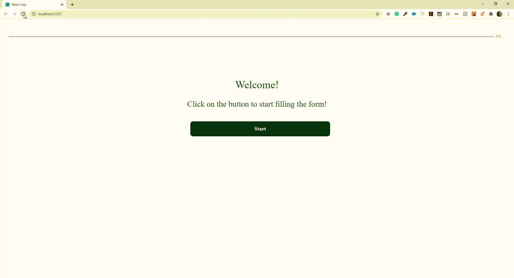

## Project Form with Progress Bar

This repository it was developed to understand how to create a multi-step form with a progress bar to indicate the progress filling each input of the form.

# Technologies Used

ReactJs ⚛️  
Typescript ⌨️  
Hooks  
Styled Components

In the project directory, you can run:

### `yarn start` or `npm start`

Runs the app in the development mode. 

Also there are some code coverage in some of the implementations of this application, you can run:

### `yarn test` or `yarn test:coverage` or using `npm test` and `npm test:coverage`

On `test:coverage` we will generate a report and a folder call coverage on the main folder of the project and you were be able to see the code coverage if you go to coverage>Lcov-report and open the index.html to visualize the report.

### Things to be improved

- Improve the code coverage of the code
- Refactor the code to use more the props and also create a FormSchema in which we could create different forms with different questions and reduce the number of pages that has same business logic.
- Improve the radio button style
- improve validation of values on input
